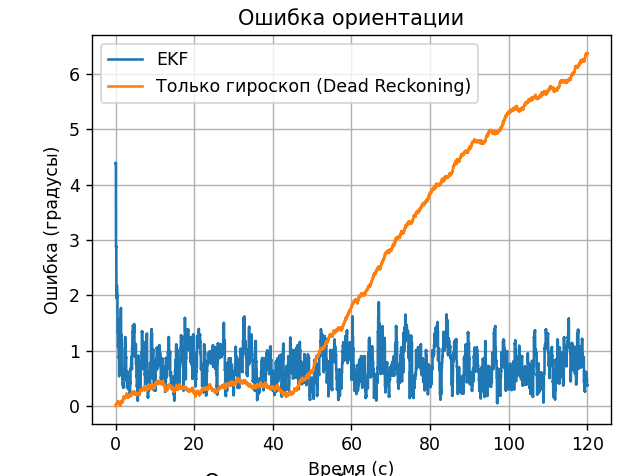
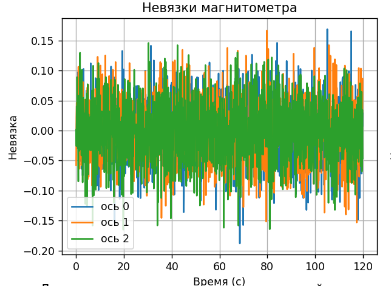
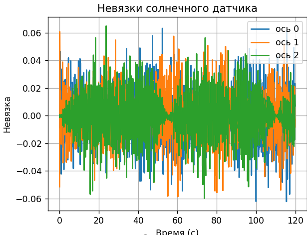
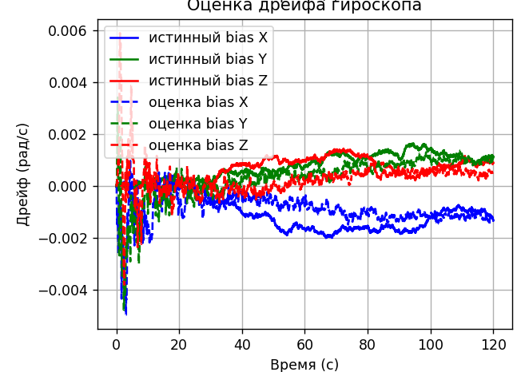
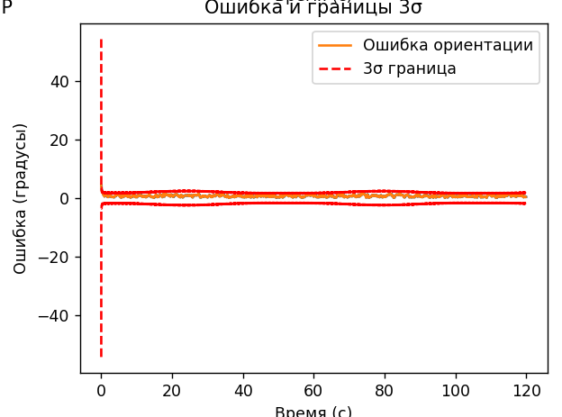
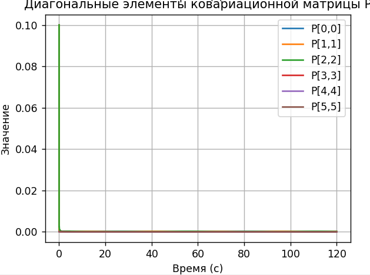

# 🛰️ Оценка ориентации спутника с помощью расширенного фильтра Калмана (EKF)

Проект демонстрирует реализацию расширенного фильтра Калмана для определения
ориентации космического аппарата по показаниям трёх датчиков:
- **гироскоп** (измеряет угловую скорость),
- **магнитометр** (измеряет вектор магнитного поля Земли),
- **солнечный датчик** (измеряет направление на Солнце).

Фильтр объединяет быстрые, но дрейфующие измерения гироскопа с медленными,
абсолютными векторными измерениями, чтобы получить точную и непрерывную оценку
ориентации. Дрейф гироскопа оценивается и компенсируется в реальном времени.

---

## 📐 Математическая модель

### Кинематика вращения
Ориентация спутника описывается единичным кватернионом $\mathbf{q}$.
Его изменение связано с угловой скоростью $\boldsymbol{\omega}$ (в связанной
системе координат) уравнением:

$$\dot{\mathbf{q}} = \frac{1}{2} \boldsymbol{\Omega}(\boldsymbol{\omega}) \mathbf{q}$$

где $\boldsymbol{\Omega}(\boldsymbol{\omega})$ — кососимметрическая матрица 4×4.

### Модели датчиков

**Гироскоп**
$$\boldsymbol{\omega}_m = \boldsymbol{\omega}_{\text{true}} + \mathbf{b} + \boldsymbol{\eta}_g,\quad \boldsymbol{\eta}_g \sim \mathcal{N}(0, \sigma_g^2 \mathbf{I})$$

Дрейф $\mathbf{b}$ эволюционирует как случайное блуждание:
$$\dot{\mathbf{b}} = \boldsymbol{\eta}_b,\quad \boldsymbol{\eta}_b \sim \mathcal{N}(0, \sigma_b^2 \mathbf{I})$$

**Магнитометр**
$$\mathbf{m}_m = \mathbf{R}(\mathbf{q})^\top \mathbf{m}_{\text{ref}} + \boldsymbol{\eta}_m$$

**Солнечный датчик**
$$\mathbf{s}_m = \frac{\mathbf{R}(\mathbf{q})^\top \mathbf{s}_{\text{ref}} + \boldsymbol{\eta}_s}{\|\ldots\|}$$

Здесь $\mathbf{R}(\mathbf{q})$ — матрица поворота из кватерниона,
$\mathbf{m}_{\text{ref}}, \mathbf{s}_{\text{ref}}$ — опорные векторы в
инерциальной системе координат.

### Расширенный фильтр Калмана (EKF)

Вектор ошибки состояния:
$$\delta\mathbf{x} = \begin{pmatrix} \boldsymbol{\delta\theta} \\ \Delta\mathbf{b} \end{pmatrix} \in \mathbb{R}^6$$

**Predict (по гироскопу)**
- Компенсация дрейфа: $\hat{\boldsymbol{\omega}} = \boldsymbol{\omega}_m - \hat{\mathbf{b}}$
- Интегрирование кватерниона RK4: $\hat{\mathbf{q}} \leftarrow \text{RK4}(\hat{\mathbf{q}}, \hat{\boldsymbol{\omega}}, \Delta t)$
- Матрица перехода: $\mathbf{F} \approx \begin{pmatrix} \mathbf{I} - [\hat{\boldsymbol{\omega}}\times]\Delta t & -\mathbf{I}\Delta t \\ \mathbf{0} & \mathbf{I} \end{pmatrix}$
- Ковариация: $\mathbf{P} \leftarrow \mathbf{F}\mathbf{P}\mathbf{F}^\top + \mathbf{Q}$

**Update (по магнитометру и солнечному датчику)**
- Предсказание измерений: $\hat{\mathbf{m}} = \mathbf{R}(\hat{\mathbf{q}})^\top \mathbf{m}_{\text{ref}},\; \hat{\mathbf{s}} = \mathbf{R}(\hat{\mathbf{q}})^\top \mathbf{s}_{\text{ref}}$
- Невязка: $\mathbf{y} = \begin{pmatrix} \mathbf{m}_m - \hat{\mathbf{m}} \\ \mathbf{s}_m - \hat{\mathbf{s}} \end{pmatrix}$
- Матрица Якоби: $\mathbf{H} = \begin{pmatrix} [\hat{\mathbf{m}}\times] & \mathbf{0} \\ [\hat{\mathbf{s}}\times] & \mathbf{0} \end{pmatrix}$
- Усиление Калмана: $\mathbf{K} = \mathbf{P}\mathbf{H}^\top (\mathbf{H}\mathbf{P}\mathbf{H}^\top + \mathbf{R})^{-1}$
- Поправка: $\delta\hat{\mathbf{x}} = \mathbf{K}\mathbf{y}$
- Обновление состояния: $\hat{\mathbf{q}} \leftarrow \hat{\mathbf{q}} \otimes \text{Quat}(\boldsymbol{\delta\theta}),\quad \hat{\mathbf{b}} \leftarrow \hat{\mathbf{b}} + \Delta\mathbf{b}$
- Ковариация: $\mathbf{P} \leftarrow (\mathbf{I} - \mathbf{K}\mathbf{H})\mathbf{P}(\mathbf{I} - \mathbf{K}\mathbf{H})^\top + \mathbf{K}\mathbf{R}\mathbf{K}^\top$

---

## ⚙️ Настройки фильтра (конфигурация EKF)

Параметры выбраны так, чтобы обеспечить баланс между точностью и устойчивостью.
Ключевой компромисс: **слишком маленькая Q → вырождение ковариационной матрицы P
(фильтр "засыпает"), слишком большая Q → чрезмерная реакция на шум (оценка дёргается)**.
Здесь Q немного завышена относительно идеальных характеристик датчиков, а R чуть
увеличен для сглаживания.

| Параметр | Значение в симуляторе | Значение в EKF | Комментарий |
|----------|------------------------|----------------|-------------|
| $\sigma_g$ (шум гироскопа) | 0.01 рад/с | **0.015 рад/с** | Небольшое завышение для устойчивости |
| $\sigma_b$ (блуждание дрейфа) | 0.0001 рад/с/√с | **0.0002 рад/с/√с** | Увеличено в 2 раза, чтобы P не вырождалась |
| $\sigma_m$ (шум магнитометра) | 0.05 | **0.08** | Умеренное завышение для сглаживания |
| $\sigma_s$ (шум солнечного датчика) | 0.02 | **0.03** | Умеренное завышение для сглаживания |
| Начальная P (угловая часть) | – | $0.1\,\text{рад}^2$ | Соответствует нач. неопр. ~18° |
| Начальная P (дрейф) | – | $10^{-4}\,(\text{рад/с})^2$ | Нач. неопр. дрейфа 0.01 рад/с |
| Минимальная подкачка P | – | $10^{-8}$ (угол), $10^{-12}$ (дрейф) | Предотвращает численное вырождение |
| Частота коррекции | – | каждые 10 шагов (1 с) | Типичная для датчиков на кубсатах |

**Формирование матриц:**
$$\mathbf{Q} = \begin{pmatrix}
(\sigma_g^2\Delta t + \frac{1}{3}\sigma_b^2\Delta t^3)\mathbf{I}_3 & \mathbf{0} \\
\mathbf{0} & \sigma_b^2\Delta t\,\mathbf{I}_3
\end{pmatrix},\quad
\mathbf{R} = \begin{pmatrix}
\sigma_m^2\mathbf{I}_3 & \mathbf{0} \\
\mathbf{0} & \sigma_s^2\mathbf{I}_3
\end{pmatrix}$$

---

## 🧪 Результаты

### 1. Ошибка ориентации
После включения реалистичных шумов EKF уверенно удерживает ошибку в пределах **1°**,
в то время как интегрирование только гироскопа (Dead Reckoning) приводит к
насыщению ошибки на уровне 180° за несколько секунд.



### 2. Невязки измерений
Невязки магнитометра ($\pm 0.05\ldots0.15$) и солнечного датчика ($\pm 0.02\ldots0.06$)
лежат в пределах коридора $\pm2\sigma$, что подтверждает статистическую
согласованность фильтра.




### 3. Оценка дрейфа гироскопа
Фильтр плавно отслеживает истинный дрейф (пунктирные линии), не "замирая" и не
осциллируя. Амплитуда оценки соответствует реальной динамике дрейфа.



### 4. Ковариационная матрица и границы 3σ
Диагональные элементы $\mathbf{P}$ стабилизируются на положительных значениях
($10^{-4}\ldots10^{-3}$ для угла, $10^{-8}\ldots10^{-7}$ для дрейфа).
Границы $\pm3\sigma$ (красный пунктир) охватывают фактическую ошибку, что
свидетельствует об адекватной оценке неопределённости.




---

## 🛠 Запуск

1. **Клонируйте репозиторий:**
   ```bash
   git clone https://github.com/Sofya-Salieva/satellite-attitude-ekf.git
   cd satellite-attitude-ekf
